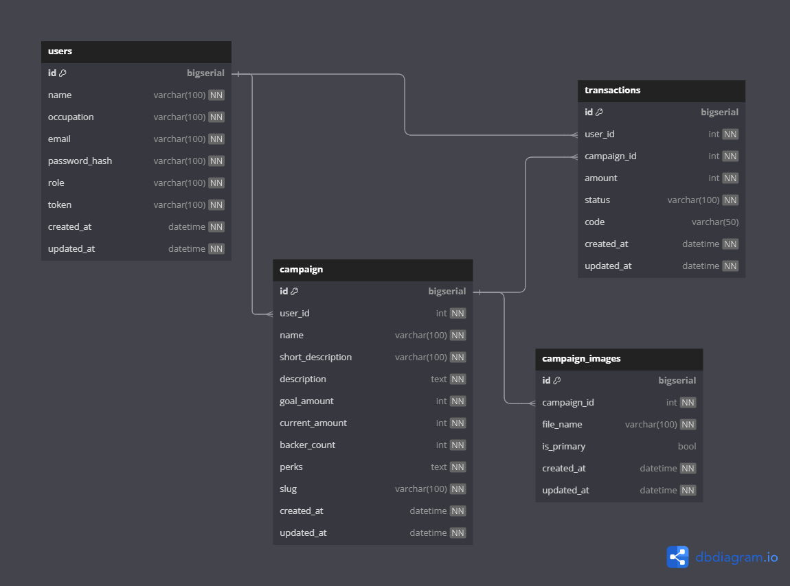

# Create template clean architecture for golang development

    - Golang 1.22
    - gorm (Mysql)
    - Redis
    - Air (like nodemon for developement)

## Development Separated into 2 branch
    - main
    use domain model into package

    - research 
    use MVC model architecture into package

## Database
    - Default
    can used with migrate from sql query file in folder sql
    make migrateup //command in terminal

    - Code migration from golang
    use from entity in each domain by default in file main.go

## Database Design

## Run Code
    - make start //docker must be running first
    - make migrate-up //migration database (optional) you can using in code based